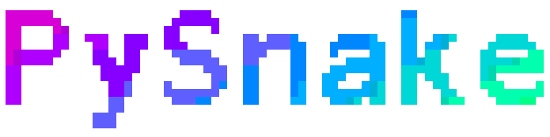

# PySnake



A python snake game based on pygame.

---

## Requirements

| Package       |  version   |
|---------------|:----------:|
| pygame        |   latest   |
| opencv-python |   latest   |
| matplotlib    |   latest   |
| numpy         |   latest   |
| tqdm          |   latest   |
| torch         |   latest   |

## Run the main game

```bash
python3 main.py
```

## Train the model using Reinforcement Learning (DQN)

```bash
python3 ai.py --train [--model-path MODEL_PATH]
```

## Play by AI

```bash
python3 ai.py [--model-path MODEL_PATH]
```
